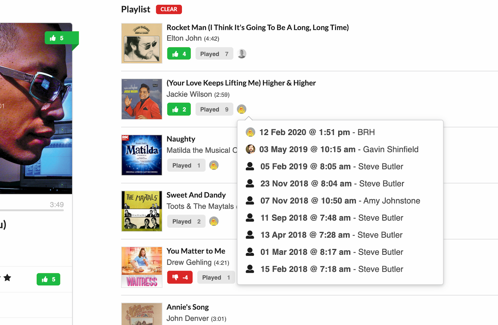

# Jukebox 2.0

An WebSocket/[Mopidy](https://github.com/mopidy) event powered JukeBox client and API



## Background

This is a work-in-progress replacement for our [existing office JukeBox](https://github.com/kyan/jukebox) that was started back on *9th Jan 2009*. That was/is a [Rails](https://github.com/rails) application with many moving parts and orginally connected to [MPD](https://github.com/MusicPlayerDaemon/MPD) directly via a socket. It has been through many modernising iterations, and now uses `Mopidy` but still has the moving parts and uses a socket connection (which now needs buffering). Things have moved fast in nearly 10 years, so it's time to make a fresh start using some new better fitting technologies.

## Overview

The Jukebox re-imagined still uses `Mopidy` but has been split into parts, Client and API (FE and BE). The BE is written in [TypeScript](https://www.typescriptlang.org/) and the FE currently is a mix of [JavaScript](https://www.javascript.com/) and TypeScript. It also uses smaller events messages passed back and forth over a websocket. Currently both the FE and BE live in this one monorepo.

## Why not use an existing Mopidy frontend

We have extra requirements for our office Jukebox to make it more interactive and office friendly, Mopidy just handles playing music. This projects adds some of these extra features:

* Information about who added a track to the playlist
* Ability for other users to rate the current track playling
* An auto track chooser that adds music when the playlist runs out
* Auto switch off
* Search for music ordered by previous vote popularity

## Requirements

* A machine that can run `nodejs`
* A `Google` account (for easy user management)
* A premium `Spotify` account (for the music)

```
$ git clone https://github.com/kyan/jukebox-js
$ cd jukebox-js
```

## Environment

Runing the app locally requires some enviroment variables to be set in the various applications. There are a bunch of `.env.example` files that just need to be duplicated in the folder they are in and the various missing parts filled in. The comments in those files should help you.

## Development

The app uses `make` to make running common tasks easier, so if you run `make help` you will see all the commands you can run against the app with a simple explaination. Some of the commands take args `make <something> args=--foo`

### Running the tests

There is currently 100% tests and coverage throughout the app as well as linting and prettier via ESLint.

Run all the tests in the same way it does on CI:
```
$ make test
```

Run just the tests for the FE or BE:
```
$ make fe-test
$ make be-test
$ make be-test args=--watchAll
$ make be-test args=--watchAll --coverage
```

You can also just run any of the scripts in `package.json` file of that project:
```
$ make be task=lint
```

You can also just ignore `make` and run everything manual if that's your thing.

### Running the app

When running the app locally you get to run a Docker instance of Mopidy on your machine. You don't get any sound but it's by far the easiest way. You just need to run:

Build the dependencies MongoDB and Mopidy
```
make build
```

Note: If you are using an M1 Macbook, the above command may fail. To fix this, you will need to set the following environment variable in your shell:
```
DOCKER_DEFAULT_PLATFORM=linux/amd64
```

Start the dependencies MongoDB and Mopidy
```
make serve
make serve -D # run in the background
```

Now you can just open a new terminal for the FE and the BE and run:

```
make be task=start
```
and
```
make fe task=start
```

This will give you a working FE and BE plus the persistence layer. The Jukebox is available
at http://localhost:3001 running in dev mode, meaning any changes will cause the server to restart.

## Technology

### Client

A ReactJS application that communicates with the JukeBox API.

### API

A NodeJS + Express application written in TypeScript that communicates with `Mongodb` and the `Mopidy` Websocket interface.

##### TypeScript

In order to use Intellisense and TypeChecking in VSCode you will need to connect VSCode to the source running in the container as that's where all the node modules are installed. To do this you need to have the `VSCode Remote - Containers` extension installed.

You can do this in various ways. Either whilst you're serving the app locally, or just via having the `*-console` script running. You run `Remote Containers - Attach to running container...` and choose the jukebox container that you started and want to connect to. This should then start a new window connecting to the container where you can edit your code. You should now get all the Intellisense and TypeChecking working in that window.

Once you have done this once, the next time when you start the container, you should see an entry in the `Remote Exporer` containers section where you can attach again from there. You can also edit the configuration so you can install in extension you want when you are editing.

### MongoDB

The API used `Mongodb` for it's perisistence layer. In development it will fire up a docker container running `Mongodb` and will point the API at it.

### Adding a new package to `package.json`

The easiest way to do this is using `make api-console` or `make client-console`

Once you have a command line you can just run `$ npm install <package>`. This will install the package and update the `package.*` files. You will be able to continue development. When you shutdown the container though the package will be missing. You need to re-build the image to make it available. So remember to run `make build-all` when you start up next time.

### Mopidy

If you so want to run your own version of Mopidy for running in production, you can buy yourself a Raspberry Pi and follow [these instructions](docs/mopidy_install.md).

## Deployment

Deployment requires a couple of npm's to be installed on your local machine.
```
$ npm install -g gh-pages
$ npm install -g shipit-cli
$ npm install -g shipit-deploy
```

### Client

To push out a new release of the [FE](frontend/) you first need just need to run:
```
$ ./scripts/deploy-client
```
This will create a `build` directory in your local `frontend` folder and then push it to Github (where the frontend is hosted). You may have to wait a min for things to propergate, but you should now have pushed a new release. You can check at https://github.com/kyan/jukebox-js/tree/gh-pages. There are ENVs you can update in the deploy scripts if you need to customise.

### Api

To push out a new release of the [BE](backend/) you need to run:
```
$ ./scripts/deploy-api
```
This will currently deploy a local branch named `release` so make sure it contains what you expect.

### mongodb

In production the API uses https://cloud.mongodb.com
